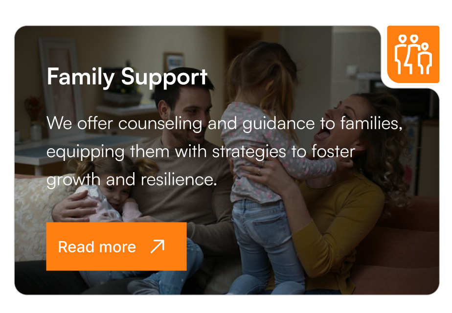

# 🌟 Family Support Business Card UI

An elegant, interactive business card built with HTML, CSS, and JavaScript — designed to promote **Family Support Services** with style and clarity. The card features a modern layout, a 3D flip animation, and hover effects that enhance user engagement.

## ✨ Features

- Responsive and clean business card design
- Hover effect with background image overlay
- 3D flip animation (front ↔ back)
- Custom-styled top and bottom icon corners
- Modular and easy-to-customize code (HTML, CSS, JS)

## 🔗 Live Demo

👉 [Click here to view the live app](https://kadunapikin.github.io/company-card/)

## 📸 Screenshot

## 📁 Project Structure
project/
├── index.html # Main HTML structure
├── style.css # Styling for layout, hover, and animations
├── script.js # JavaScript for flip logic
└── images/
├── background-image.jpg
├── Top-right-image.jpg
├── bottom-right-image.jpg
└── screenshot.jpg # Add a screenshot of your UI here

## 🚀 Getting Started

### 1. Clone the Repository

git clone https://github.com/your-username/family-support-card.git
cd family-support-card

### 2. Run the Project
Open index.html directly in your browser

Or use Live Server in Visual Studio Code for a better dev experience

🛠 Technologies Used
HTML5

CSS3 (Flexbox, Transitions, Transform)

Vanilla JavaScript

🧩 Customization Tips
Images: Replace files inside the images/ folder to fit your brand.

Colors: Update the theme colors in style.css (background-color, color, hover states).

Content: Modify service descriptions and headings in index.html to reflect your organization’s goals.

📄 License
This project is open-source and available under the MIT License.

Built with ❤️ to showcase social support services in a simple, beautiful way.
